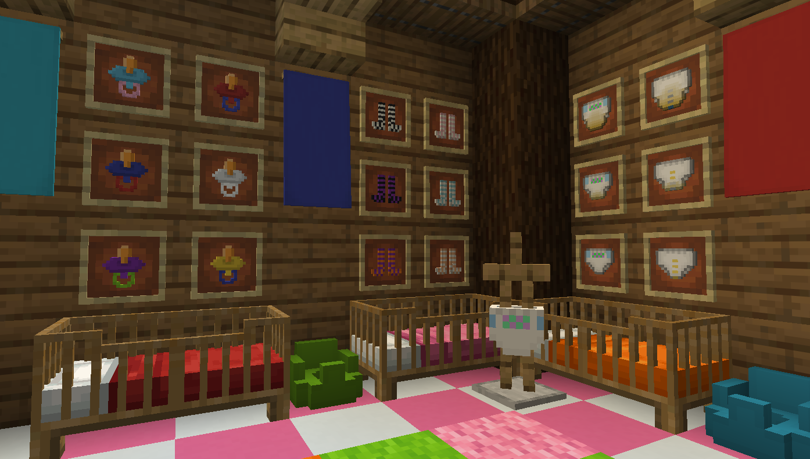

# LittleCraft

**LittleCraft** is a NeoForge mod for **Minecraft 26.1.2**, designed to bring immersive **Age Regression** (Agere) and **ABDL** elements into roleplay gameplay. It introduces dynamic character scaling, functional roleplay items, and unique player-to-player interactions tailored for community servers where size mechanics and thematic props matter.

**Key Features:**
- **Dynamic Age Scaling:** Your player model, hitbox, and camera height scale smoothly based on your selected age (ranging from 6 to 18).
- **Functional Diapers:** Adds wearable diapers for immersive roleplay.
  - **The System:** The diaper has capacity and used attributes that calculate its visual wetness; these attributes can be extended by adding additional padding. While equipped, the diaper transfers fluid from the player's bladder to the diaper's NBT data to simulate wetness or fullness. The player model visually updates to reflect its current state.
  - **Custom Designs (NBT):** Supports custom textures via the `DESIGN` NBT tag. Expand available styles by adding textures to `littlecraft/textures/item/diaper/{design}/` (`dry.png`, `wet.png`, `full.png`) and declaring the design in the item model JSON. Texture state thresholds: **dry** `< 10 ml`, **full** `≥ capacity − 100 ml` or `≥ 5000 ml`, **wet** otherwise.
  - **Interactive Diaper Changing:** Another player can change your diaper by right-clicking you while holding a fresh diaper in their main hand.
  - **Bi-color Tinting:** The item icon supports two independently dyeable color layers (base + overlay) blended via the MC dye recipe.
- **Body Mechanics — Bladder & Stomach:**
  - **Per-food data-driven values:** every food item maps to explicit `stomach` (g) and `bladder` (ml) amounts defined in `data/<namespace>/littlecraft/food_effects/<item>.json`. All 42 vanilla foods ship with defaults. Other mods can add their own files under `data/<modid>/littlecraft/food_effects/` without a compile-time dependency on LittleCraft. Values are fully datapack-overridable.
  - **Digestion buffers:** eating fills an `eaten` buffer; drinking fills a `drinked` buffer. These drain gradually into their respective reservoirs — `eaten → stomach` at **1 g / 20 ticks**, `drinked → bladder` at **1 ml / 5 ticks**. Both buffers are unbounded. Cake block eating is also captured (including all candle-cake variants).
  - **Need effect:** if a buffer tries to drain but its target reservoir is already full, the drain is skipped and the **Need** effect (amber, no particles) is applied for 5 s, signalling urgency.
  - Pressing the **Piss** keybind transfers fluid from the bladder. Pressing the **Poop** keybind expels stomach contents.
  - **Output priority (both piss and poop):** equipped diaper (if not full) → any other equippable pants (marks as pooped/wet; applies **Shame**) → seated potty → bare floor (applies **Shame**). Performing either action without a diaper or potty now always works and always applies the **Shame** effect (crimson, no particles, 30 s).
  - **Incontinence — age-based involuntary release:**
    - Every 10 ticks, if bladder is at capacity with `drinked ≥ bladderCap / 2`, **or** stomach is at capacity with `eaten ≥ stomachCap / 2`, a random roll is made.
    - Chance scales with age: **age < 18** → up to 30 % (younger = higher, linear from 30 % at age 0 to ~1.7 % at age 17); **age 18–40** → 0.1 % base floor; **age > 40** → up to 30 % (linear, capping at age 70).
    - On a successful roll the **Incontinence** effect is applied for 5–10 s (random).
    - **While Incontinence is active** (every 40 ticks, only if not actively using the Piss key): performs involuntary piss through the full routing chain, with amount scaling by bladder fullness (`max(1, bladder × 24 / bladderCap)`). If stomach is simultaneously at capacity, also performs one involuntary poop through the same routing chain.
  - The **Stink** effect is applied whenever an item tagged `is_pooped` is equipped in the legs slot, regardless of item type.
- **Potty (16 colors):** Functional sit-on block available in all 16 dye colors.
  - Right-click to sit; press **Shift** to stand up.
  - Stores up to **1 000 ml** of piss and **1 000 g** of poop independently.
  - Broken with contents → drops the potty item carrying its NBT data, exactly like a shulker box. Re-placing restores the stored amounts.
  - Placing the potty in a crafting grid (no other items) resets both values to zero.
- **Carry Mechanic:** Adult players (age 18+) can pick up little players (ages 6–12) by right-clicking them with an empty main hand.
  - The carried player is visually held at arm's height and loses movement control, though they retain full camera rotation.
  - Either player can end the carry at any time by pressing Shift.
  - Both players receive clear chat notifications when the interaction starts and ends.
- **Customizable Thigh-Highs:** A versatile character personalization item for the feet slot.
  - **Dual-Color Blending:** Two independently dyeable color layers — base fabric and stripes — blended using the standard MC dye recipe (1 dye = both layers, 2 dyes = first → base, second → stripes).
  - **Enchantment Support:** Zero armor points but fully enchantable for utility.
- **Pacifier:** A wearable head-slot item rendered as a 3D model on the player's face using the vanilla `CustomHeadLayer` pipeline (same mechanism as carved pumpkin).
  - **Dual-Color Blending:** Two independently dyeable parts — nipple/body and guard ring — using the same blending logic as Thigh-Highs.
  - In inventory and in-hand, displays as a flat two-layer icon tinted by the active colors.
  - On the head, switches to a physical box-geometry block model with `tintindex`-based coloring.
  - Crafted from a diamond ring of **Plastic** pieces.
- **Cozy Cribs:** Decorative and functional colored cribs tailored specifically for little players.
- **New Potions:**
  - **Potion of Regression:** Brewed from an **Awkward Potion** and a **Golden Dandelion**.
    - **Drinking:** Reduces the player's age by 1.
    - **Splash Variant:** Reverts adult animals and monsters into their baby forms (where applicable).
  - **Potion of Growth:** Brewed from an **Awkward Potion** and **Bone Meal**.
    - **Drinking:** Increases the player's age by 1.
    - **Splash Variant:** Forces baby animals and monsters to grow into adults instantly.
    - **Lingering Variant:** Acts as a continuous AoE fertilizer, applying a bone meal effect to nearby crops and plants once per second while the cloud is active.

---

## Commands

| Command | Permission | Description |
|---------|------------|-------------|
| `/age get` | Everyone | Shows your current little age. |
| `/age set <number>` | Cheats | Sets your own little age to the given number. |
| `/age <player> get` | Everyone | Shows another player's current little age. |
| `/age <player> set <number>` | Cheats | Sets another player's little age. |

---

## Brewing Recipes

| Result | Ingredients |
|--------|-------------|
|  Potion of Regression |  Awkward Potion +  Golden Dandelion |
|  Potion of Growth |  Awkward Potion +  Bone Meal |

Splash and Lingering variants follow standard vanilla brewing (Gunpowder / Dragon's Breath).

---

## Localization

Supported languages:

- English (`en_us`)
- French (`fr_fr`)
- German (`de_de`)
- Japanese (`ja_jp`)
- Russian (`ru_ru`)
- Spanish (`es_es`)
- Ukrainian (`uk_ua`)

---

## Technical Details

LittleCraft supports both **Singleplayer** and **Multiplayer** environments.  
Player data is stored using NeoForge **Attachment Types** and synced between client and server.

| Attachment | Type | Description |
|------------|------|-------------|
| `littlecraft:little_age` | `int` | The player's current little age (6..17 = infant scale, 18+ = adult scale). |
| `littlecraft:bladder` | `int` | Current bladder fill in ml. Max scales with age (200–2000 ml). |
| `littlecraft:stomach` | `int` | Current stomach fill in g. Max scales with age (100–1000 g). |
| `littlecraft:drinked` | `int` | Pending liquid buffer (unbounded). Drains into `bladder` at 1 ml / 5 ticks; drain is blocked and **Need** is applied when bladder is full. |
| `littlecraft:eaten` | `int` | Pending food buffer (unbounded). Drains into `stomach` at 1 g / 20 ticks; drain is blocked and **Need** is applied when stomach is full. |

**MobEffects:**

| Effect | Color | Particles | Description |
|--------|-------|-----------|-------------|
| `littlecraft:regression` | — | default | Instantaneous; reduces age by 1. |
| `littlecraft:growth` | — | default | Instantaneous; increases age by 1. |
| `littlecraft:stink` | olive-brown | none | Applied while an `is_pooped` item is worn; removed on water contact. |
| `littlecraft:incontinence` | — | none | While active: involuntary piss every 40 ticks (scaled by bladder fullness) + poop if stomach is full. |
| `littlecraft:need` | amber | none | Applied when a digestion buffer is blocked by a full reservoir. Refreshes every drain interval. |
| `littlecraft:shame` | crimson | none | Applied for 30 s when pissing or pooping without a diaper or potty (other pants, or bare floor). |

**Data-driven food effects** (`SimpleJsonResourceReloadListener`):
- Folder: `data/<namespace>/littlecraft/food_effects/<item>.json`
- Format: `{ "stomach": <int>, "bladder": <int> }`
- The file's namespace + path resolves directly to the item/block `Identifier` (e.g. `data/minecraft/littlecraft/food_effects/apple.json` → `minecraft:apple`).
- Ships with defaults for all 42 vanilla food items. Other mods drop a file under their own namespace — no compile dependency required. Datapacks can override any entry.
- Fallback values for unregistered items: EAT animation → +5 stomach / +10 bladder; DRINK animation → +250 bladder.

Custom **MobEffects** (`littlecraft:regression`, `littlecraft:growth`) are instantaneous and apply their logic immediately when the potion is consumed or the splash hits an entity.

The **Potty** block entity stores `piss` (0–1000 ml) and `poop` (0–1000 g). On break, the values are serialised into `DataComponents.BLOCK_ENTITY_DATA` on the dropped item and restored automatically when the item is re-placed, following the same pattern as vanilla shulker boxes.

The **Diaper**, **Thigh-Highs**, and **Pacifier** store their color and state data in `DataComponents.CUSTOM_DATA`. Item model tinting uses the MC 26.1.2 `items/*.json` pipeline with registered `ItemTintSource` types (`littlecraft:thigh_highs_base_color`, `littlecraft:thigh_highs_stripe_color`, `littlecraft:pacifier_body_color`, `littlecraft:pacifier_ring_color`). The `is_pooped` boolean in `CUSTOM_DATA` on any equippable legs item triggers the **Stink** effect each server tick.

---

## Version History

| Game Version | Mod Version | Changes                                                                                                                                                                                                                                |
|--------------|-------------|----------------------------------------------------------------------------------------------------------------------------------------------------------------------------------------------------------------------------------------|
| 1.20.1 | 1.0         | Base feature of toggling between little and adult modes                                                                                                                                                                                |
| 1.20.1 | 2.0         | Added Diaper item for immersive ABDL roleplay                                                                                                                                                                                          |
| 1.20.1 | 2.0.2       | Added Diaper Change mechanic - another player can change your diaper                                                                                                                                                                   |
| 26.1.2 | 2.0.3       | Player model gradual scaling based on little age                                                                                                                                                                                       |
| 26.1.2 | 2.0.4       | Added Potion of Regression and Potion of Growth with splash and lingering variants, license changed to GPL 3.0-ONLY                                                                                                                    |
| 26.1.2 | 2.0.5       | Colored Cribs                                                                                                                                                                                                                          |
| 26.1.2 | 2.0.6       | Carry mechanic - adult players can carry little players (age 1-12)                                                                                                                                                                     |
| 26.1.2 | 2.0.7       | Customizable bi-color Thigh-Highs added to the mod                                                                                                                                                                                     |
| 26.1.2 | 3.0.0       | Bladder and Stomach Systems introduced                                                                                                                                                                                                 |
| 26.1.2 | 3.0.1       | The Potty introduced - 16 colors, sit mechanic, NBT persistence, crafting clear; diaper per-design textures (dry/wet/full); `is_pooped` tag generalised to all equippable pants items; output priority system (diaper → pants → potty) |
| 26.1.2 | 3.0.2       | Pacifier (head-slot, bi-color, 3D head model)                                                                                                                                                                                          |
| 26.1.2 | 3.0.3       | Annoying HUD is hidden, now it only appears when you wear a pacifier with name "Debug"                                                                                                                                                  |
| 26.1.2 | 3.1.0       | **Digestion system overhaul:** per-food stomach/bladder values driven by data-pack JSON files (`data/<ns>/littlecraft/food_effects/`); digestion buffers (`eaten`, `drinked`) drain gradually into stomach/bladder; cake block eating captured. **HUD:** all four stats (stomach, eating, bladder, drinking) shown bottom-right, right-aligned. **New effects:** `need` (buffers blocked by full reservoir) and `shame` (accident without diaper/potty). **Incontinence rework:** age-based chance (up to 30 % for young/elderly, 0.1 % floor for all ages); triggers INCONTINENCE effect; while active performs involuntary piss (scaled 1–24 ml / 40 ticks) and poop (when stomach full) through the full routing chain. **Piss/poop routing unified:** `performPiss` / `performPoop` static helpers shared by packets and incontinence; other-pants piss now also applies Shame; bare-floor piss/poop fully implemented. |

- **Current Maintained Minecraft Version:** 26.1.2
- **No backports** to older versions are planned.

---

## Planned Features

- Additional caregiver interaction mechanics (feeding, rocking, etc.).
- Additional baby equipment (plushies, toys, high chairs, bottles).
- Additional diaper designs and customization options.

---

## License

**GPL-3.0-only** - see [LICENSE](LICENSE) for full terms.

## Author

**David Eichendorf** (`dev1lroot` / `DavyBoy`)  
Contact: admin@dev1lroot.com
